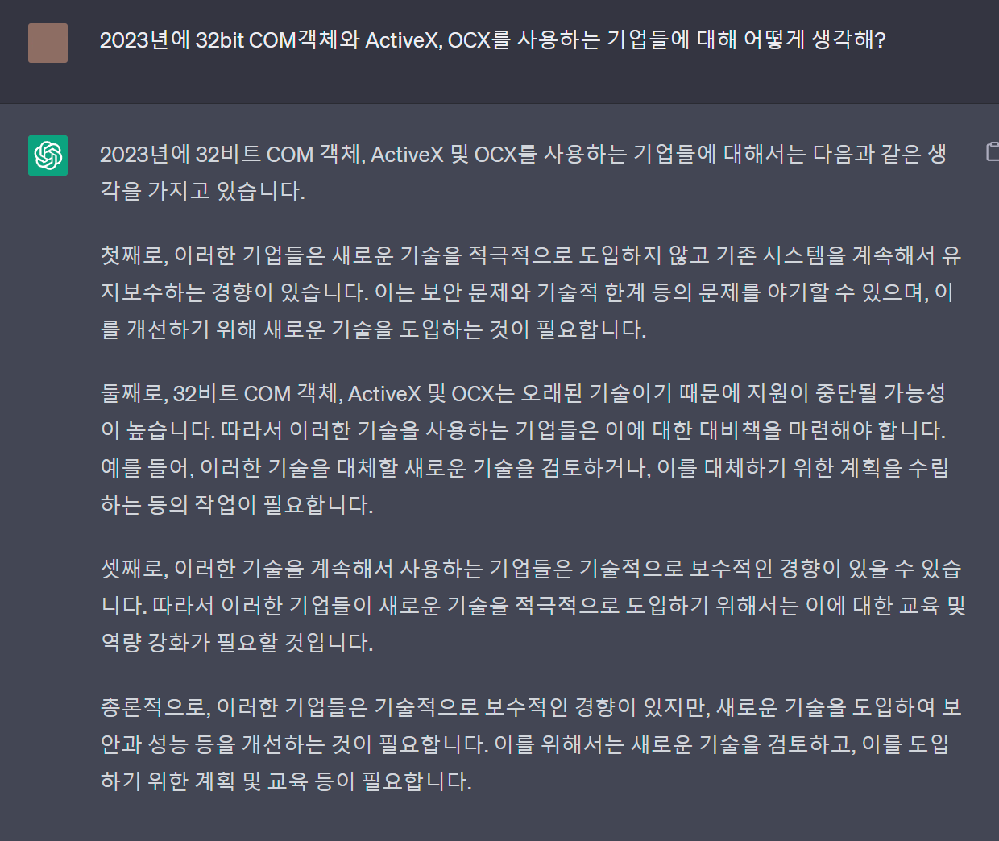

# DllSurrogateHelper
Tool to create multiple dll surrogates from clsid. Daishin Cybos is the target.

https://github.com/vilmire/DllSurrogateHelper/releases/tag/v1.0.0

대신증권 Cybos COM객체를 64비트 어플리케이션에서 실행할 수 있도록 Dll Surrogate를 등록시켜주는 프로그램입니다.
사용법은 release 참조. 혹 누락된 clsid가 있다면 텍스트박스에 입력 후 Add를 누르면 목록에 추가됩니다.

https://learn.microsoft.com/en-us/windows/win32/com/dll-surrogates
https://github.com/rogerorr/DllSurrogate/blob/main/DllSurrogate.rtf

